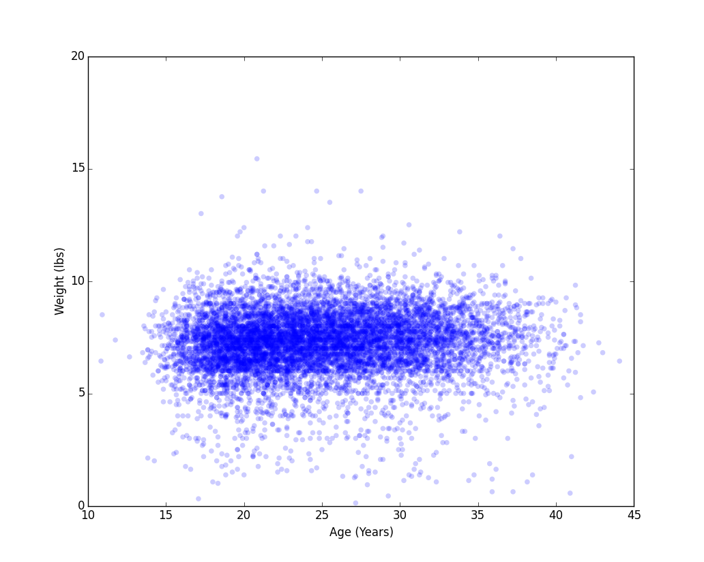
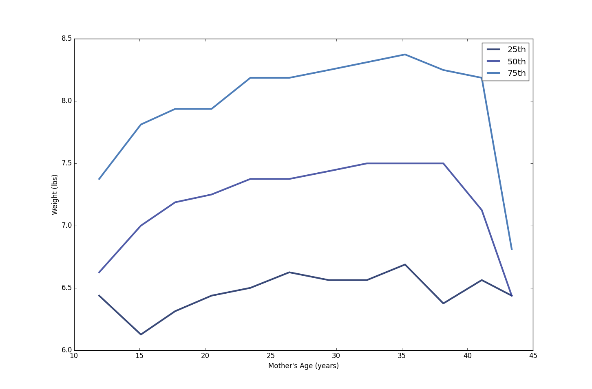

[Think Stats Chapter 7 Exercise 1](http://greenteapress.com/thinkstats2/html/thinkstats2008.html#toc70) (weight vs. age)

###Scatter Plot

###Percentile Weights Plot

>> Pearson's Correlation Coefficient: 0.0688339703541
>> Spearman's Rank Correlation: 0.0946100410966
>> Looking at the scatter plot, it seems like there is little if any correlation between weight and age. Furthermore, when we look at the correlation metrics we see very low correlations. We do see that Pearson's and Spearman's is slightly different which may be explained by non-linear relationship or presence of outliers. 
