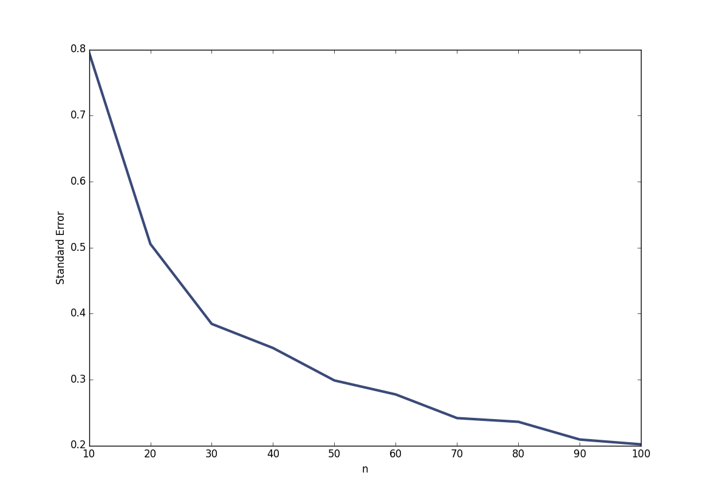

[Think Stats Chapter 8 Exercise 2](http://greenteapress.com/thinkstats2/html/thinkstats2009.html#toc77) (scoring)

>> Standard Error: 0.8696073918666415

>> Confidence Interval: 1.4089752751891069, 3.3970529794717463

| n | Standard Error | Confidence Interval |
|---|----------------|---------------------|
|10|0.8|1.42,3.22|
|20|0.51|1.52,2.71|
|30|0.38|1.62,2.54|
|40|0.35|1.64,2.52|
|50|0.3|1.68,2.45|
|60|0.28|1.71,2.42|
|70|0.24|1.75,2.35|
|80|0.24|1.72,2.33|
|90|0.21|1.78,2.3|
|100|0.2|1.77,2.3|
